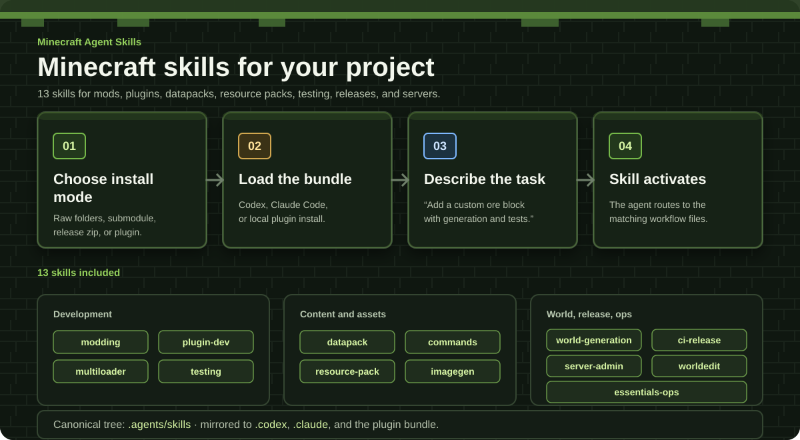

# Minecraft Agent Skills — Fabric Server Companion

A trimmed fork of [Jahrome907/minecraft-agent-skills](https://github.com/Jahrome907/minecraft-agent-skills), focused on skills that complement a **Minecraft Java Edition Fabric server-side development workflow**.

The intended baseline is:

- Minecraft Java Edition **1.21.8 or newer**
- **Fabric** as the primary mod loader
- Server-side mod development where possible
- Java 21 for the 1.21.x line
- Codex / Claude Code agent-skill workflows

This fork intentionally removes broad or overlapping skills so an agent is less likely to route a Fabric task into Paper/Bukkit, NeoForge, Forge, or multiloader guidance.

## Included skills

| Skill | Purpose |
| --- | --- |
| `minecraft-commands-scripting` | Vanilla commands, selectors, scoreboards, NBT, and RCON automation |
| `minecraft-ci-release` | CI, artifact publishing, versioning, GitHub Actions, Modrinth, and CurseForge release workflows |
| `minecraft-world-generation` | Biomes, dimensions, configured/placed features, structures, and worldgen data |
| `minecraft-imagegen` | Minecraft-oriented concept art, pack icons, thumbnails, textures, and UI mockups |
| `minecraft-server-admin` | Server hosting, JVM/runtime operations, backups, proxies, deployment, and troubleshooting |
| `minecraft-fabric-server-dev` | Fabric server-side mod implementation, Fabric API, Mixin, Polymer, and source analysis |
| `fabric-server-validation` | Fabric GameTest, runtime validation, protocol/client compatibility, and E2E evidence |
| `minecraft-java-content-engineering` | Minecraft Java datapack and resource-pack content engineering |
| `minecraft-java-reference-hub` | Version-pinned Minecraft Java domain and command/NBT reference workflows |
| `minecraft-java-world-nbt` | Safe inspection, diffing, and targeted edits for Java world NBT and Anvil region files |

## Intentionally removed

The following upstream skills were removed because they overlap with a separate Fabric-focused specialist bundle or are outside this fork's scope.

| Removed skill | Reason |
| --- | --- |
| `minecraft-modding` | Replaced by a Fabric server-side development specialist skill |
| `minecraft-testing` | Replaced by a Fabric-specific validation and GameTest/E2E skill |
| `minecraft-datapack` | Covered by the Java content-engineering skill |
| `minecraft-resource-pack` | Covered by the Java content-engineering skill |
| `minecraft-multiloader` | Not needed for a Fabric-only workflow |
| `minecraft-plugin-dev` | Paper/Bukkit/Spigot plugin development is out of scope |
| `minecraft-essentials-ops` | EssentialsX operations are out of scope |
| `minecraft-worldedit-ops` | WorldEdit plugin operations are out of scope |

The Fabric specialist skills included in this bundle provide the following implementation and validation routes:

- `minecraft-fabric-server-dev`
- `fabric-server-validation`
- `minecraft-java-content-engineering`

## Installation

Install only one copy of each skill for the host you use. Loading both a raw skill tree and the packaged plugin can expose duplicates.

| Host | Install path |
| --- | --- |
| Codex | Copy `.agents/skills/` into the project's `.agents/skills/` |
| Older Codex hosts | Use `.codex/skills/` only if that host still expects the legacy location |
| Claude Code | Copy `.claude/skills/` into the project's `.claude/skills/` |
| Plugin bundle | Keep `.agents/plugins/marketplace.json` and `plugins/minecraft-codex-skills/` together |

For Claude Code, the bundled plugin can also be loaded directly:

```bash
claude --plugin-dir ./plugins/minecraft-codex-skills
```

`minecraft-imagegen` still requires image-generation capability from the host or another connected tool.

<!-- markdownlint-disable MD033 -->
<p align="center">
  
</p>
<!-- markdownlint-enable MD033 -->

## Recommended routing

For a Fabric server-side project, use the narrowest skill that matches the task.

| Task | Preferred skill |
| --- | --- |
| Fabric Java code, Fabric API, Mixin, server lifecycle, networking | `minecraft-fabric-server-dev` |
| Fabric GameTest, runtime validation, E2E, client compatibility checks | `fabric-server-validation` |
| Datapacks, resource packs, mcfunction, recipes, loot, assets | `minecraft-java-content-engineering` |
| Vanilla command syntax, selectors, scoreboards, RCON | `minecraft-commands-scripting` |
| Biomes, dimensions, features, structures | `minecraft-world-generation` |
| GitHub Actions and release automation | `minecraft-ci-release` |
| Hosting, deployment, backup, proxy, JVM/runtime operations | `minecraft-server-admin` |
| Visual concepts and raster assets | `minecraft-imagegen` |

Version-sensitive APIs should always be checked against the exact target Minecraft/Fabric version rather than copied from an older 1.20.x or early 1.21.x example.

## Example requests

```text
Add a Fabric 1.21.8 server-side command without requiring a client mod.
```

```text
Validate this Fabric GameTest setup and check whether a vanilla client can join.
```

```text
Create the datapack assets required by this server-side Fabric feature.
```

```text
Add a custom placed feature for Minecraft 1.21.8 and verify the registry/data layout.
```

## Maintaining this fork

Treat `.agents/skills/` as the canonical skill tree.

After changing a canonical skill, synchronize the mirrors and run the repository checks:

```bash
npm run sync:skills
npm run check
```

The sync step refreshes:

- `.codex/skills/`
- `.claude/skills/`
- `plugins/minecraft-codex-skills/skills/`

The copied skill directories are self-contained and do not require this repository's Node tooling in the target Minecraft project.

## Upstream

This repository is derived from:

- [Jahrome907/minecraft-agent-skills](https://github.com/Jahrome907/minecraft-agent-skills)

The trimming in this fork is intentional and optimized for a Fabric-first, server-side workflow rather than broad Minecraft ecosystem coverage.

## License

[MIT](LICENSE)
